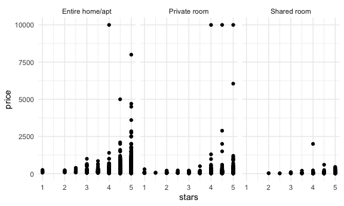
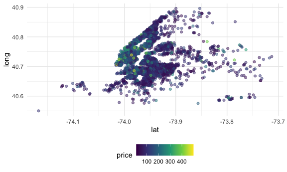

Case\_Study
================

## Load a dataset

``` r
library(p8105.datasets)
data(nyc_airbnb)
```

-   Look at price and room type..

``` r
nyc_airbnb = nyc_airbnb %>% 
  mutate(stars = review_scores_location/2) %>% 
  rename(borough = neighbourhood_group)
```

let count things –janitor::tabyl

``` r
nyc_airbnb %>% 
  janitor::tabyl(borough,room_type)
```

    ##        borough Entire home/apt Private room Shared room
    ##          Bronx             192          429          28
    ##       Brooklyn            7427         9000         383
    ##      Manhattan           10814         7812         586
    ##         Queens            1388         2241         192
    ##  Staten Island             116          144           1

it is the same thing as janitor ::tabyl

``` r
nyc_airbnb %>% 
  count(borough,room_type) %>% 
  pivot_wider(names_from = room_type,
              values_from = n)
```

    ## # A tibble: 5 × 4
    ##   borough       `Entire home/apt` `Private room` `Shared room`
    ##   <chr>                     <int>          <int>         <int>
    ## 1 Bronx                       192            429            28
    ## 2 Brooklyn                   7427           9000           383
    ## 3 Manhattan                 10814           7812           586
    ## 4 Queens                     1388           2241           192
    ## 5 Staten Island               116            144             1

``` r
nyc_airbnb %>% 
  ggplot(aes(x = stars, y = price)) + geom_point() + facet_grid(.~room_type)
```

    ## Warning: Removed 10037 rows containing missing values (geom_point).



``` r
nyc_airbnb %>% 
  filter(borough == "Manhattan") %>% 
  group_by(neighbourhood) %>% 
  summarize(mean_price = mean(price,na.r = TRUE)) %>% 
  arrange(mean_price)
```

    ## # A tibble: 32 × 2
    ##    neighbourhood       mean_price
    ##    <chr>                    <dbl>
    ##  1 Marble Hill               83.6
    ##  2 Inwood                    86.5
    ##  3 Washington Heights        90.1
    ##  4 Morningside Heights      107. 
    ##  5 Harlem                   117. 
    ##  6 Roosevelt Island         122. 
    ##  7 Two Bridges              123. 
    ##  8 East Harlem              128. 
    ##  9 Chinatown                158. 
    ## 10 Upper East Side          172. 
    ## # … with 22 more rows

coord\_flip — x axis and y axis exchange the places reorder - take the
median of second variable, usually the second one is numeric value

``` r
nyc_airbnb %>% 
  filter(borough == "Manhattan", price <= 1000) %>% 
  mutate(neighbourhood = fct_reorder(neighbourhood,price)) %>% 
  ggplot(aes(x=neighbourhood, y= price)) + 
  geom_boxplot() +
  coord_flip() +
  facet_grid(.~room_type)
```


Price vs location

``` r
nyc_airbnb %>% 
  filter(price<500) %>% 
  sample_n(5000) %>% 
  ggplot(aes(x=lat, y= long, color = price))+
  geom_point(alpha =0.5)
```



## retry leaflet

``` r
library(leaflet)
nyc_airbnb %>% 
  leaflet() %>% 
  addTiles() %>% 
  addMarkers( ~lat, ~ long)
```
